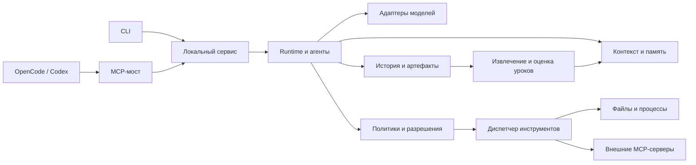

# Harness by Ghost_Raven

```text
  ╭─╮     ╭─╮
  │ ├─────┤ │    Harness by Ghost_Raven
  │ ├─────┤ │    задачи · файлы · ответы
  ╰─╯     ╰─╯
```

**Локальное приложение для работы с ИИ-агентами из терминала, OpenCode и Codex.** Вы выбираете проект, подключаете модель и описываете задачу. Harness управляет контекстом, инструментами, разрешениями, специалистами и сохранением результатов.

Возможности:

- Живой CLI с историей задач, черновиками, журналом, пояснениями модели и полным ответом.
- Проекты с принятой целью и планом, этапами, проверками, исправлениями и явной приёмкой результата.
- Роли из конфигурации: самостоятельная работа, передача специалисту и параллельные подзадачи.
- Несколько провайдеров моделей, аккаунт Codex и внешние MCP-инструменты.
- Просмотр изменений перед одобрением записи и восстановление файлов из резервных копий.
- Продолжение после паузы, новый вопрос в сохранённой беседе, выборочная очистка данных.
- База знаний с доказательствами, проверкой уроков, версиями и откатом.

Текущая версия проекта — **0.4.0**. Runtime закреплён на **Node.js 24.21.0**, npm — **11.x**. Файлы запуска устанавливают Node в папку приложения, сохраняя системную установку.

В **0.4.0** добавлен проектный режим: цель, предложенный план, принятие человеком, последовательные этапы, проверки и исправления, затем приёмка результата. Для коротких запросов остаются обычные задачи. [Работа с проектами](docs/projects.md).

В **0.3.1** исправлена повторная подготовка при повреждении маркеров и остановка потомков npm при отмене или таймауте. Проверенная установка библиотек сохраняется независимо от пересборки приложения.

В выпуске **0.3.0** локальное ядро получило проверяемые контракты команд, потоковое чтение истории, каталог задач и исторический LRU-кэш до 64 МиБ. Повреждённые записи переводят сервис в режим просмотра и диагностики; подтверждённые операции не повторяются. Формат JSONL остаётся `schemaVersion: 1`, настройки и опыт старых задач сохраняются. [Описание выпуска и проверка поставки](docs/release-stability.md).

## Содержание

- [Быстрый старт](#быстрый-старт)
- [Работа с задачами](#работа-с-задачами)
- [Проекты с планом и проверками](#проекты-с-планом-и-проверками)
- [Команды CLI](#команды-cli)
- [Конфигурация, модели и роли](#конфигурация-модели-и-роли)
- [OpenCode, Codex и MCP](#opencode-codex-и-mcp)
- [Самообучение](#самообучение)
- [Хранение, удаление и диагностика](#хранение-удаление-и-диагностика)
- [Архитектура и расширение](#архитектура-и-расширение)
- [Разработка, проверки и поставка](#разработка-проверки-и-поставка)
- [Решение проблем](#решение-проблем)
- [Подробная документация](#подробная-документация)

## Быстрый старт

Распакуйте проект целиком в папку, доступную для записи. При первом запуске нужен интернет для загрузки Node и зависимостей. Для работы модели потребуется аккаунт провайдера, аккаунт Codex или запущенный совместимый локальный API.

| Система | Как открыть                                                             |
| ------- | ----------------------------------------------------------------------- |
| macOS   | Дважды нажмите [Запустить Harness.command](<Запустить Harness.command>) |
| Windows | Дважды нажмите [Запустить Harness.cmd](<Запустить Harness.cmd>)         |
| Linux   | В папке приложения выполните `sh ./start.sh`                            |

1. Дождитесь подготовки приложения. Она выполняется автоматически; следующие запуски используют проверенный кэш.
2. Выберите **папку проекта**, затем провайдера и доступную вам модель. Ключ API вводится в скрытое поле настроек. Для **«Codex · мой аккаунт»** отдельный API-ключ не нужен: мастер использует существующий вход или предлагает авторизацию.
3. Выберите **«Новая задача»** и опишите результат, например: «Изучи структуру проекта и объясни, где находится обработка заказов». Отправьте текст через **Ctrl+S**.
4. Следите за работой в карточке задачи. Если требуется разрешение, проверьте операцию и её аргументы, затем одобрите или отклоните её.

Ключ можно оставить в памяти текущего окна либо явно сохранить в системном хранилище через настройки. При недоступном системном хранилище остаётся ввод на время работы. Значения ключей не записываются в JSON-конфиги проекта.

Рабочий стол сам запускает локальный сервис или подключается к уже работающему. При выходе окно-владелец закрывает свой сервис; подключённое к чужому сервису окно только отключается. Итоговое сообщение показывает, какой вариант произошёл. Для фоновой работы и подключения MCP можно держать отдельное окно `serve`.

Фактически проверены **macOS arm64 и Linux arm64**. Файлы запуска предусматривают также x64 и Windows x64/arm64, но нативный Windows-прогон пока не выполнен. Подробности — в [переносимости](docs/portability.md). Для первого знакомства есть [пошаговая инструкция](docs/getting-started.md) и [Начните здесь.txt](<Начните здесь.txt>).

## Работа с задачами

### Навигация и ввод

Один экран заменяет другой. Списки задач, открытая задача, знания, разрешения и настройки перечитывают изменяемые данные примерно раз в секунду. Выбор, вкладка и прокрутка сохраняются; временная потеря связи не стирает показанные данные.

| Где                  | Клавиши                 | Действие                                        |
| -------------------- | ----------------------- | ----------------------------------------------- |
| Меню                 | ↑ / ↓, Enter            | Выбрать и открыть пункт                         |
| Редактор задачи      | Enter                   | Добавить строку                                 |
| Редактор задачи      | Ctrl+S                  | Отправить сообщение                             |
| Редактор задачи      | Esc                     | Сохранить черновик и вернуться                  |
| Активная задача      | Ctrl+W                  | Написать модели без остановки задачи            |
| Открытая задача      | Tab                     | Переключить «Все», «Журнал», «Мысли», «Ответ»   |
| Открытая задача      | ↑ / ↓, PgUp / PgDn, End | Прокрутка и переход к последним событиям        |
| Открытая задача      | Enter                   | Открыть действия, включая части большого ответа |
| Выполняющаяся задача | Ctrl+C                  | Остановить задачу                               |
| Просмотр или меню    | Esc                     | Вернуться назад                                 |

Многострочная вставка не отправляется автоматически. Черновики разделяются по окнам и беседам. Если связь оборвалась при отправке, действие **«Повторить отправку»** использует сохранённый ключ запроса и проверяет прежний запуск.

Вкладка **«Мысли»** показывает только пояснения, которые передал провайдер; у Codex это опубликованное резюме. Наличие таких пояснений зависит от модели. Скрытые рассуждения и зашифрованные блоки в интерфейс не выводятся.

Уточнить активную задачу можно через **Ctrl+W** или **Enter → «Написать модели»**. В редакторе Enter добавляет строку, Ctrl+S отправляет сообщение, Esc сохраняет черновик. Сообщение сохраняется сразу и попадает корневому агенту на следующем шаге после текущих инструментов; работающие подзадачи автоматически не отменяются и не получают уточнение. На паузе оно ждёт продолжения, при запросе разрешения — решения человека. В карточке виден размер очереди.

Если задача завершилась во время ввода, текст остаётся в **«Черновиках сообщений»**. Повтор после потери связи использует тот же ключ и не дублирует сообщение. Отдельный новый запуск при этом не создаётся.

### Продолжение и восстановление

**Сессия (`sessionId`)** — вся беседа. **Запуск (`runId`)** — отдельная задача или следующий вопрос внутри неё. В одной сессии допускается один выполняющийся либо приостановленный запуск.

| Состояние              | Что оно означает                                                       | Что делать                                           |
| ---------------------- | ---------------------------------------------------------------------- | ---------------------------------------------------- |
| `running`              | Задача выполняется                                                     | Наблюдать за журналом или остановить                 |
| `awaiting_approval`    | Операция ждёт человека                                                 | Открыть разрешения и принять решение                 |
| `paused`               | Достигнут предел шагов, лимит провайдера либо требуется восстановление | Устранить причину и выбрать «Продолжить после паузы» |
| `completed`            | Получен итог, в том числе возможный уточняющий вопрос модели           | Задать следующий вопрос в этой беседе                |
| `failed` / `cancelled` | Выполнение завершилось ошибкой или отменой                             | Открыть действия и продолжить беседу новым этапом    |

`resume RUN_ID` продолжает **тот же запуск на паузе**. После отмены, ошибки или готового ответа используется новый вопрос с прежним `sessionId`. Его история включает сохранённые результаты инструментов. Подтверждённые операции прежнего этапа автоматически не выполняются заново.

Возобновление проверяет неизвестные операции во всей беседе, включая скрытые этапы. Если проверка относится к прежнему этапу, откройте его в истории и подтвердите фактический результат. Затем можно возобновить текущую задачу: модель получит результат проверки, а выполненная запись не повторится.

Если мутация началась, но результат не подтверждён, она отмечается как **`unknown` — «результат неизвестен»**. Проверьте фактическое состояние файла или внешней системы, зафиксируйте результат через действия задачи либо `resolve`, затем продолжите. После принудительного завершения самого сервиса его дочерняя программа ОС может ещё работать: это тоже нужно проверить.

Прерванное восстановление файла тоже требует проверки: откройте «Проверить прерванную операцию» в действиях задачи или выполните `harness resolve-restore RUN_ID`. Harness сравнит файл с исходной и записанной версиями. Подтверждение сохраняет результат вашей проверки и не переписывает файл. Если содержимое отличается от обеих версий, опишите фактический результат; автоматический откат такого изменения останется недоступен.

При сообщении «Сбой записи · нужен перезапуск» исполнитель уже остановлен, но его последнее состояние не удалось сохранить. Проверьте свободное место и доступ к папке состояния, полностью закройте Harness и откройте заново. Сервис восстановит журнал; продолжить задачу можно после проверки неизвестных исходов. До перезапуска новые изменения задач заблокированы.

Большие ответы читаются частями. Сохранение ответа из меню и команда `answer` выгружают полный текст. В «Моих задачах» доступны поиск, страницы истории, скрытые этапы и технические подробности. Для записей `fs.write` доступны diff и восстановление исходных байтов; сторонние изменения файла блокируют автоматическое восстановление. Произвольные команды и внешние MCP-операции таким откатом не покрываются.

Перед восстановлением файла завершите работающие задачи. Если продолжение этой беседы стоит на паузе, сначала продолжите или остановите его. Следующий вопрос учтёт восстановление даже из более раннего или скрытого этапа. Если беседа изменилась в другом окне во время отправки, Harness предложит повторить запрос с актуальной историей.

## Проекты с планом и проверками

Для работы из нескольких этапов откройте **Проекты → Новый проект** и опишите результат. Harness предложит план, который можно изменить обычными словами. До начала исполнения интерфейс показывает роли, зависимости, точные команды проверок и действия для ручной проверки. После принятия плана Harness проверяет исходное состояние, выполняет этапы и предлагает принять проверенный итог.

Карточка проекта разделена на **Обзор**, **План**, **Проверки** и **Журнал**. Списки и открытые карточки обновляются без повторного входа. Можно приостановить работу, уточнить задание этапу, повторить проверки, убрать проект в архив или удалить его с предпросмотром связанных данных. Изменение файлов после проверки требует нового подтверждения. «Недавние папки» в настройках переключает рабочую папку; история проектов доступна в отдельном пункте «Проекты».

Проектные операции также доступны через группу `projects` в CLI. Для скриптов каждая мутация требует ревизию карточки и ключ повторного запроса; принятие плана и результата дополнительно проверяет их версии. Публичный MCP по-прежнему содержит три инструмента. [Пошаговая работа с проектами и справочник команд](docs/projects.md).

## Команды CLI

Примеры с `npm start --` выполняются **из корня приложения**, когда Node 24.21.0 и npm 11 доступны в `PATH`; подготовка описана [ниже](#разработка-проверки-и-поставка). Сам CLI — `node dist/interfaces/cli.js`. Глобальная установка команды `harness` не требуется.

Без команды `npm start` открывает рабочий стол в интерактивном терминале. Отдельные команды `run`, `status` и другие подключаются к уже запущенному сервису.

```bash
# Первое окно: создать конфигурацию для выбранного проекта и запустить сервис
npm start -- init --workspace /путь/к/проекту
npm start -- serve --config /путь/к/проекту/.harness/config/harness.json
```

Мастер `init` спрашивает имя переменной окружения для ключа. Сам ключ должен быть доступен процессу **`serve`** до его запуска; `.env` автоматически не загружается. Для ввода ключа через интерфейс используйте обычный рабочий стол.

```bash
# Второе окно: проверить подключение и поставить задачу
npm start -- doctor
npm start -- run "Объясни структуру проекта" --workspace /путь/к/проекту
npm start -- status
```

### Справочник команд

К содержимому первого столбца добавляйте префикс `npm start --`. `RUN_ID`, `SESSION_ID`, `INVOCATION_ID` и `CANDIDATE_ID` заменяются соответствующими идентификаторами из статуса или технических подробностей.

| Команда                                                        | Назначение                                                                                                   |
| -------------------------------------------------------------- | ------------------------------------------------------------------------------------------------------------ |
| `init [directory]`                                             | Создать конфиги; доступны `--workspace`, `--provider`, `--model`, `--base-url`, `--key-env`, `--no-api-key`  |
| `serve --config PATH`                                          | Запустить сервис в текущем терминале; остановка — Ctrl+C                                                     |
| `doctor [--config PATH]`                                       | Проверить сервис или конфигурацию без его запуска                                                            |
| `run "Текст" --workspace PATH --profile PROFILE_ID`            | Начать задачу; профиль можно не указывать                                                                    |
| `run "Следующий вопрос" --workspace PATH --session SESSION_ID` | Продолжить беседу новым запуском                                                                             |
| `status [RUN_ID]`                                              | Список задач или состояние одной; `--watch` наблюдает выбранный запуск                                       |
| `answer RUN_ID`                                                | Вывести полный ответ                                                                                         |
| `message RUN_ID "Уточнение" --key MESSAGE_KEY`                 | Отправить сообщение активной задаче; при повторе сохранить ключ и текст                                      |
| `cancel RUN_ID`                                                | Отменить задачу и дочерние ветки, дождаться остановки исполнителей                                           |
| `resume RUN_ID`                                                | Продолжить запуск на паузе и наблюдать за ним                                                                |
| `approvals`                                                    | Рассмотреть ожидающие разрешения; в JSON-режиме — получить список                                            |
| `resolve RUN_ID INVOCATION_ID --result-file checked.txt`       | Подтвердить проверенный человеком результат; `--failed` обозначает неуспех, требуется интерактивный терминал |
| `resolve-restore RUN_ID`                                       | Проверить прерванное восстановление файлов; требуется интерактивное подтверждение                            |
| `iterations [--run RUN_ID] [--limit 256]`                      | Показать или изменить предел шагов новых задач либо выбранной задачи на паузе                                |
| `budget`                                                       | Показать учёт токенов задач и обучения                                                                       |
| `delete RUN_ID [--yes]`                                        | Убрать этап из списка; активная задача при этом останавливается                                              |
| `purge RUN_ID`                                                 | Удалить всю беседу после просмотра состава и подтверждения                                                   |
| `reset`                                                        | Выбрать общий сброс задач, знаний или обоих разделов                                                         |
| `logs status`, `logs on`, `logs off`                           | Проверить, включить или выключить диагностический лог                                                        |
| `learning status`, `learning inspect CANDIDATE_ID`             | Посмотреть опыт, очередь и доказательства урока                                                              |
| `learning pause`, `learning resume`                            | Управлять очередью обучения                                                                                  |
| `learning feedback RUN_ID --text "Проверенный результат"`      | Оставить подтверждение; для опровержения — `--negative`, при необходимости `--candidate CANDIDATE_ID`        |
| `learning rollback --reason "Причина"`                         | Откатить активный выпуск опыта                                                                               |
| `mcp-config --client opencode`, `mcp-config --client codex`    | Напечатать конфигурацию подключения клиента                                                                  |
| `mcp`                                                          | Запустить stdio-мост к локальному сервису; stdout занят протоколом                                           |

`--help` доступен у CLI и отдельных команд: `npm start -- run --help`.

### Каталог состояния и автоматизация

Глобальные флаги: `--state PATH`, `--json`, `--no-color`, `--help`, `--version`. Каталог состояния выбирается в порядке **`--state` → `HARNESS_STATE_DIR` → `~/.harness`**. Все окна, `serve` и MCP-мост должны использовать один и тот же каталог.

`--config` принадлежит командам `serve` и `doctor`. Без него конфигурация ищется от текущей папки к корню: `.harness/config/harness.json`, `harness.json`, затем `config/harness.json` на каждом уровне. Рабочий стол также использует сохранённый выбор проекта. `run --profile` выбирает профиль конфигурации обслуживающего сервиса.

Для JSON и перенаправления ответа вызывайте **Node напрямую**: npm добавляет собственные строки в stdout. В JSON-режиме наблюдение выводит отдельные JSON-объекты по строкам; интерактивные вопросы не открываются.

```bash
node dist/interfaces/cli.js --json status RUN_ID
node dist/interfaces/cli.js answer RUN_ID > answer.md
node dist/interfaces/cli.js --json run --stdin --workspace /путь/к/проекту --key request-001 --detach < task.txt
```

В PowerShell для stdin: `Get-Content -Raw task.txt | node dist/interfaces/cli.js --json run --stdin --workspace C:\project --detach`.

`--detach` возвращает `runId` и `sessionId` без наблюдения. При повторе отправки с тем же `--key` и теми же аргументами возвращается прежний запуск; изменение аргументов с тем же ключом отклоняется. Это полезно после разрыва связи.

Наблюдение через `run`, `resume` или `status RUN_ID --watch` заканчивается также при паузе и ожидании разрешения. Для автоматизации проверяйте поле `status`: код выхода `0` сам по себе не означает, что задача завершена. После решения в `approvals` можно снова открыть `status RUN_ID --watch`. Команда `answer` не ждёт завершения: без готового ответа она сообщает «Ответ ещё не получен.».

`doctor` проверяет настройки и доступность сервиса, но не заменяет запрос к облачной модели. Без запущенного сервиса он возвращает `ready: false` и код выхода `1`, даже если конфигурация корректна. При работающем сервисе используется его конфигурация, если явно не указан другой `--config`.

## Конфигурация, модели и роли

[config/harness.json](config/harness.json) — пример главного манифеста. Относительные пути в нём и файлах ролей считаются от каталога манифеста. Мастер `init` создаёт `.harness/config/` в выбранном проекте; существующий каталог не перезаписывается. Рабочий стол хранит созданные им конфиги в `<state>/projects/`.

| Файл                                                         | Содержимое                                                                                    |
| ------------------------------------------------------------ | --------------------------------------------------------------------------------------------- |
| [harness.json](config/harness.json)                          | Ссылки на файлы, разрешённые рабочие папки, роли и профиль по умолчанию, координация, пределы |
| [profiles.json](config/profiles.json)                        | Провайдер, модель, URL, имя переменной ключа, контекст, ответ, таймаут, повторы               |
| [roles.json](config/roles.json)                              | Промпт, разрешения, файлы памяти и необязательный `modelProfile` каждой роли                  |
| [policy.json](config/policy.json)                            | Машинные решения `allow`, `deny`, `ask` и условия аргументов                                  |
| [rules.json](config/rules.json), [prompts/](config/prompts/) | Авторские правила, базовый промпт и специализации                                             |
| [tools.json](config/tools.json)                              | Запрещённые пути, размер результатов, таймаут и внешние MCP-серверы                           |
| [learning.json](config/learning.json)                        | Включение обучения и доверенные контрольные задачи                                            |

### Провайдеры

ID профиля — ключ записи в `profiles.json`; `provider` — тип адаптера, а `model` — ID модели у провайдера. Одному провайдеру можно задать несколько профилей. Имена моделей из примеров нужно сверять с доступом своего аккаунта.

| `provider`          | Транспорт                                       | Доступ                                                |
| ------------------- | ----------------------------------------------- | ----------------------------------------------------- |
| `qwen`              | Совместимый Chat Completions API через AI SDK   | Переменная `apiKeyEnv`                                |
| `openai`            | OpenAI Chat Completions через AI SDK            | Переменная `apiKeyEnv`                                |
| `anthropic`         | Нативный адаптер Anthropic AI SDK               | Переменная `apiKeyEnv`                                |
| `google`            | Нативный адаптер Google AI SDK                  | Переменная `apiKeyEnv`                                |
| `openai-compatible` | Совместимый облачный или локальный API          | Ключ по требованиям сервера; возможен режим без ключа |
| `codex`             | Официальный Codex app-server, `codex://account` | Вход в аккаунт Codex                                  |

Дополнительные настройки API передаются через `options`. У Codex поддерживается `options.effort`; `outputTokens` используется для планирования контекста, но app-server не гарантирует такой максимум токенов отдельного ответа. Неполный поток и пустой ответ не выдаются за успешное выполнение.

Пример создания профиля для уже запущенного совместимого локального API:

```bash
node dist/interfaces/cli.js --json init --workspace /путь/к/проекту --provider openai-compatible --model MODEL_ID --base-url http://127.0.0.1:11434/v1 --no-api-key
```

Замените `MODEL_ID` на имя установленной на вашем сервере модели. Harness не устанавливает саму модель и не запускает этот API.

### Политики и координация

Разделены три слоя: **машинные политики**, **авторские инструкции** и **проверенный опыт**. Запрет имеет приоритет над разрешением. Права текущей роли пересекаются с глобальной политикой и правами всей цепочки ролей; делегирование и handoff не расширяют права родителя. Опыт и результаты инструментов не меняют эти разрешения.

В шаблоне есть `coordinator`, `researcher`, `executor`, `reviewer`. Можно менять названия, промпты, права и модели. При `coordination: "auto"` начальный план через `agents.plan` выбирает самостоятельную работу, передачу роли либо параллельные ветки из доступного каталога. При `"manual"` обязательного начального планирования нет; модель использует разрешённые `agents.delegate`, `agents.await`, `agents.handoff`. Handoff выполняется отдельно после завершения подзадач ветки.

Чтобы добавить специализацию, создайте Markdown-промпт и запись в `roles.json` с `prompt` и `permissions`; при необходимости укажите `memory` и `modelProfile`. Шаблоны имён инструментов и строковых аргументов — glob. Например, разрешение чтения документации:

```json
{ "tool": "fs.read", "decision": "allow", "args": { "path": "docs/**" } }
```

Точная схема и политика проверяются перед каждым вызовом. `ask` ожидает решения человека и не расходует таймаут исполнения. Одобрение связано с конкретными аргументами, ролью, вызовом и снимком конфигурации и используется один раз. В шаблоне `process.exec` требует одобрения; проверяйте политику `fs.write` выбранного проекта — мастер рабочего стола предлагает подтверждение записей, а исходный шаблон разрешает файловые операции.

### Пределы и применение изменений

| Параметр                  | По умолчанию | Область                                          |
| ------------------------- | ------------ | ------------------------------------------------ |
| `limits.agents`           | 4            | Одновременно активные агенты дерева              |
| `limits.depth`            | 2            | Глубина делегирования                            |
| `limits.modelConcurrency` | 2            | Общий параллелизм запросов моделей               |
| `limits.reads`            | 4            | Параллельные чтения в общем диспетчере           |
| `limits.turns`            | 256          | Итерации дерева до следующей паузы               |
| `limits.handoffs`         | 8            | Передачи ролей в дереве                          |
| `tools.timeoutMs`         | 60 000       | Исполнение инструмента и запросы обнаружения MCP |
| `tools.resultBytes`       | 32 768       | Порог сохранения большого результата в артефакт  |

Токеновых квот Harness нет. `budget` показывает учёт расхода, а не денежный счёт и не ограничитель. Старые `limits.runTokens`, `limits.dailyTokens`, `learning.dailyTokens` читаются для совместимости, но не применяются. Ограничения аккаунта провайдера, окна контекста, ответа и числа шагов действуют отдельно.

**Предел шагов:** настройка из меню или `iterations --limit 256` сохраняется в `<state>/iteration-settings.json` и имеет приоритет над `limits.turns` для новых задач. Уже начатая задача хранит свой предел; менять его можно на паузе через `iterations --run RUN_ID --limit 256`. Возобновление открывает следующую порцию шагов, сохраняя общий счётчик и историю.

Каждый запуск фиксирует конфигурацию, память и `learningVersion`. Авторские изменения применяются к новым запускам. Смена внешних MCP-подключений, `limits.reads`, `limits.modelConcurrency` или `learning.enabled` требует перезапуска сервиса. Восстановление использует сохранённый снимок и проверяет совместимость этих настроек. [Подробнее о ролях и восстановлении](docs/coordination-and-recovery.md).

## OpenCode, Codex и MCP

Подключения работают в двух направлениях: **OpenCode или Codex вызывают Harness**, а **Harness вызывает модели и внешние MCP-инструменты**. Выбор Codex как модели и регистрация Harness в Codex — независимые настройки.

### Harness для OpenCode и Codex

Оставьте рабочий стол-владелец открытым либо запустите отдельный `serve`. Затем получите конфигурацию с фактическими путями Node, CLI и состояния:

```bash
node dist/interfaces/cli.js mcp-config --client opencode
node dist/interfaces/cli.js mcp-config --client codex
```

Первая команда печатает JSON для OpenCode, вторая — TOML для Codex. Добавьте полученный блок в настройки соответствующего клиента; после переноса Harness в другую папку сгенерируйте блок заново. Генератор не редактирует настройки автоматически. Если используется другой каталог данных, передавайте тот же `--state PATH` генератору и сервису. MCP-мост сам сервис не запускает. Оба варианта работы с Codex описаны в [отдельном руководстве](docs/codex.md).

| MCP-инструмент   | Вход                                                                                               | Результат                                                                            |
| ---------------- | -------------------------------------------------------------------------------------------------- | ------------------------------------------------------------------------------------ |
| `harness.run`    | `message`, `workspace`, `requestKey`; необязательные `profile`, `sessionId`, `expectedParentRunId` | `runId`, `sessionId`                                                                 |
| `harness.status` | `runId`; необязательные `cursor`, `waitMs` (0–25 000), `resultCursor`                              | Состояние, события и курсор, агенты, разрешения, версия опыта и ответ либо его часть |
| `harness.cancel` | `runId`                                                                                            | Отмена дерева задачи                                                                 |

Передавайте абсолютный `workspace`, непустое `message` длиной до 100 000 символов и `requestKey` длиной 1–200 символов. `expectedParentRunId` проверяет, что следующий вопрос относится к ожидаемому последнему этапу беседы, и используется вместе с `sessionId`. Ключ запроса защищает повторную отправку от создания второго запуска.

События и текст ответа имеют разные курсоры. Для событий используйте `cursor` и `hasMoreEvents`; для большого ответа — `resultPage.hasMore` и следующий запрос с `resultCursor: resultPage.nextCursor`. Курсор ответа измеряется в кодовых единицах UTF-16; используйте полученное значение без пересчёта. Поле `result` при `resultTruncated: true` содержит только начало ответа. Возвращается до 100 событий за страницу. [Контракт постраничного чтения](docs/ipc-pagination.md).

Подтверждение разрешений, ручное восстановление, удаление данных и управление обучением модели через MCP недоступны. При `awaiting_approval` человек принимает решение в CLI Harness.

### Внешние инструменты для Harness

В `tools.json` добавьте `mcp` по [примеру stdio и Streamable HTTP](examples/tools-mcp.json). В `tools` каждого сервера явно перечислите допустимые имена и классификацию `read` / `write`. Инструмент появится как `mcp.<server-id>.<tool-name>`; дополнительно разрешите его глобальной политикой и нужной ролью.

Для stdio поле `env` сопоставляет имя переменной дочернего процесса с именем переменной окружения сервиса. Для HTTP `tokenEnv` указывает переменную bearer-токена. Интерактивный OAuth внешних MCP-серверов не реализован. Схемы результатов проверяются для инструментов всех страниц каталога. После изменения подключения перезапустите сервис.

**Исполнение происходит на вашей машине с правами пользователя ОС.** Файловые инструменты проверяют workspace и запрещённые пути, но Harness не создаёт ОС-песочницу. `process.exec` исполняет буквальный argv без неявного shell; разрешённая программа имеет доступ к ресурсам ОС. Ей передаётся ограниченный набор системных переменных, без автоматического наследования ключей моделей. На Windows `.cmd` и `.bat` требуют явного `cmd.exe`; JavaScript CLI можно запускать через `node.exe`.

## Самообучение

Самообучение накапливает **рекомендации для следующих задач**. Веса модели, авторские промпты и исполняемый код не переписываются. Каждый урок связан с доказательствами, рабочей папкой, ролью и профилем модели.

1. Сохранённые результаты инструментов и обратная связь человека становятся источниками доказательств. Заявления модели об успехе недостаточно.
2. Модель предлагает структурированный кандидат; проверяются ссылки, дубликаты, конфликты и область применения.
3. Текущая версия и кандидат сравниваются на целевом случае и независимых контрольных задачах, по три раза для каждой версии. Проверочные ожидания скрыты от генератора уроков, внешние действия заменены тестовыми инструментами.
4. Улучшение целевого случая, отсутствие новых провалов и соблюдение контрактов позволяют опубликовать новую версию опыта. Уже выполняющиеся задачи сохраняют свою версию.
5. Отрицательная обратная связь или подтверждённая регрессия могут отозвать урок и откатить выпуск. Причина сохраняется; оценка отозванного урока не отправляет следующие запросы.

**В исходном `learning.json` задано `cases: []`: без контрольного набора уроки автоматически не применяются.** Начните с [examples/learning-suite.json](examples/learning-suite.json), задав собственные `target` и `holdout`, инструменты и ожидания `includes`, `excludes`, `calls`. Учебный пример сам по себе не доказывает улучшение на ваших задачах.

Очередь выполняет одно задание и уступает пользовательской работе между запросами; начатый запрос может завершиться. Ручная пауза, частичные оценки и очередь сохраняются после перезапуска. В контекст попадает только применимый опыт, не больше 10% входного бюджета и 2000 оценочных токенов.

В **«Базе знаний»** доступны все кандидаты, доказательства, оценки, поиск, очередь и версии. Урок можно экспортировать в Markdown через Enter. `baseline` в технических данных означает исходную версию без накопленного опыта. [Правила обратной связи и отзыва](docs/learning-feedback.md).

## Хранение, удаление и диагностика

По умолчанию данные находятся в `~/.harness` — папке текущей учётной записи. Один сервис владеет одним каталогом состояния. macOS/Linux используют Unix-сокет, Windows — именованный канал с локальным токеном. Данные хранятся локально без шифрования.

| Путь внутри `<state>`             | Назначение                                                                     |
| --------------------------------- | ------------------------------------------------------------------------------ |
| `runs/`                           | JSONL-журналы запусков и атомарные JSON-снимки                                 |
| `indexes/`, `search/`             | Восстанавливаемые смещения журналов, каталог и данные поиска по полным ответам |
| `output/`                         | Поток ответов и опубликованных пояснений модели                                |
| `artifacts/`                      | Полные большие результаты инструментов                                         |
| `file-backups/`                   | Исходные файлы для восстановления записей `fs.write`                           |
| `drafts/`                         | Черновики и состояние повторной отправки                                       |
| `learning.jsonl`, `learning.json` | Доказательства, кандидаты, очередь, оценки и выпуски опыта                     |
| `exports/`                        | Markdown-экспорты уроков                                                       |
| `projects/`, `desktop.json`       | Конфиги проектов мастера и выбор рабочего стола                                |
| `credentials.json`                | Идентификаторы явно сохранённых ключей; сами значения — в системном хранилище  |
| `iteration-settings.json`         | Предел шагов новых задач                                                       |
| `logs/`, `diagnostics.json`       | Опциональный диагностический лог и его настройка                               |

Перед побочным эффектом записывается начало операции, после него — результат. JSONL служит источником истины; ошибка зеркального снимка не отменяет уже сохранённое событие. Восстановленные после аварии задачи ожидают явного продолжения. Для резервной копии сначала остановите сервис, затем скопируйте каталог состояния и конфиги проектов; ключи системного хранилища при переносе на другой компьютер подключаются отдельно.

Журналы проверяются по вложенным схемам, последовательности событий и связям идентификаторов. Обычное чтение ничего не исправляет. Только владелец состояния при запуске может удалить незавершённый хвост; повреждённая полная запись требует диагностики. Отсутствующий или устаревший индекс строится заново из журнала. Неизвестный результат записи по-прежнему требует проверки человеком.

```sh
npm start -- doctor --verify-history
npm start -- doctor --rebuild-index
npm start -- doctor --export harness-diagnostics.json
```

Проверка и перестроение работают через владельца активного сервиса либо под блокировкой каталога при остановленном сервисе. Перестроение меняет только производные данные. Экспорт содержит версии, счётчики и коды ошибок; тексты задач, ключи, аргументы инструментов и абсолютные пути исключены. Существующий файл экспорта не перезаписывается. [Подробности диагностики](docs/diagnostics.md).

### Что удаляют команды

| Действие                      | Удаляемые данные                                                                                                                                              |
| ----------------------------- | ------------------------------------------------------------------------------------------------------------------------------------------------------------- |
| `delete` / «Убрать из списка» | Только скрывает этап; история остаётся в «Показать убранные задачи»                                                                                           |
| `purge` / «Удалить навсегда»  | Вся беседа `sessionId`, включая скрытые этапы, потоки, индексы, поисковые данные, кэши, артефакты, резервные копии, связанные знания и их внутренние экспорты |
| `reset --scope tasks`         | Все задачи, история и черновики; накопленные знания с доказательствами сохраняются                                                                            |
| `reset --scope learning`      | Накопленные знания и очередь; старые задачи исключаются из повторного автоматического обучения                                                                |
| `reset --scope all`           | Задачи и накопленные знания вместе                                                                                                                            |

Общий сброс доступен через **«Настройки → Очистка данных»**. Настройки, подключения, ключи, файлы проектов, сохранённые в workspace ответы, диагностические логи и числовой учёт расхода сохраняются. При очистке только задач фрагменты их содержимого могут остаться в доказательствах знаний. После полного удаления остаются служебные UUID/hash-маркеры для защиты от повторного исполнения.

Для удаления навсегда используется просмотр состава и токен подтверждения; изменившийся состав требует нового просмотра. Активная работа и неразрешённые `unknown` блокируют окончательную очистку.

```bash
node dist/interfaces/cli.js --json purge RUN_ID --preview
node dist/interfaces/cli.js --json purge RUN_ID --confirm TOKEN
node dist/interfaces/cli.js --json reset --scope all --preview
node dist/interfaces/cli.js --json reset --scope all --confirm TOKEN
```

`TOKEN` берётся из `previewToken` предыдущего ответа. Перед подтверждением проверьте список удаляемых данных. Начатая очистка восстанавливается после аварии по сохранённому намерению.

### Логи

`npm start -- logs on` включает диагностический лог, `logs off` выключает, `logs status` показывает путь и состояние. То же доступно в настройках CLI. Файлы `logs/harness.jsonl` и две ротации ограничены 1 МиБ каждый.

В диагностический лог попадают технические события, ID задачи, имена команд, длительность и безопасные коды ошибок. Тексты задач, API-ключи и сырой вывод провайдеров туда не записываются. **Полная история задач хранится отдельно**, и отключение диагностики не отключает её сохранение. Ошибки записи лога видны в настройках и не меняют результат задачи.

Проблемы установки и сборки записываются в **`.tools/setup.log` в папке приложения**.

## Архитектура и расширение

Один npm-проект и один локальный сервис, собранный через NestJS standalone. CLI и MCP обращаются к нему через локальный IPC. История, планирование, разрешения и версия опыта принадлежат Harness; SDK отвечают за транспорт модели и MCP.



### Цикл исполнения

1. Собрать системный промпт, роль, правила, память, применимый опыт, summary и историю. Актуальная задача повторяется в конце; схемы передаются отдельно через `tools`.
2. Вызвать провайдера и принимать текстовые дельты для интерфейса.
3. Проверить завершение ответа: текст завершает ход, структурированные вызовы запускают инструменты, handoff меняет роль. Оборванные вызовы не выполняются.
4. Проверить схему, политику и разрешение. Независимые чтения выполняются параллельно, мутации последовательно; чтение не перескакивает через предыдущую запись.
5. Сохранить результат каждого вызова с его ID. Ошибки возвращаются модели, большие результаты — через артефакты с порционным чтением.
6. Обновить историю. При 75% оценочного входного бюджета запустить compaction завершённых обменов, сохранив ограничения и версию опыта. Обязательный контекст, который не помещается после сжатия, приводит к диагностике `CONTEXT_LIMIT`.
7. Продолжать до результата, ожидания человека, паузы или отмены. Корень собирает результаты дочерних задач перед итоговым ответом.

### Карта модулей

| Каталог                                                          | Ответственность и точки входа                                                                |
| ---------------------------------------------------------------- | -------------------------------------------------------------------------------------------- |
| [configuration](src/configuration/)                              | Схемы, загрузка и создание конфигурации                                                      |
| [runtime](src/runtime/)                                          | `engine.ts` — жизненный цикл; `agent-loop.ts` — цикл роли; `executor.ts` — выполнение вызова |
| [agents](src/agents/)                                            | Планирование по ролям, делегирование, сбор результатов и handoff                             |
| [context](src/context/)                                          | Память, сборка сообщений, бюджет контекста и compaction                                      |
| [policy](src/policy/)                                            | Пересечение прав и однократные разрешения                                                    |
| [providers](src/providers/)                                      | `ModelProvider`, AI SDK и отдельный адаптер Codex                                            |
| [tools](src/tools/)                                              | `ToolExecutor`, реестр, диспетчер, файловые и процессные операции                            |
| [mcp-client](src/mcp-client/)                                    | Подключение внешних серверов и проверка результатов                                          |
| [sessions](src/sessions/)                                        | Журналы, снимки, артефакты, черновики и восстановление                                       |
| [learning](src/learning/)                                        | `LearningStore`, `LearningEvaluator`, доказательства, оценки и выпуски                       |
| [interfaces](src/interfaces/)                                    | `application.ts` — Nest DI; команды CLI, живые экраны, IPC и MCP-мост                        |
| [application](src/application/), [diagnostics](src/diagnostics/) | Общая очистка данных и диагностическое логирование                                           |

Стек: TypeScript strict с target ES2022, NestJS, Commander и Clack, log-update, picocolors, wrap-ansi, Ora, jsdiff, Vercel AI SDK, официальный MCP TypeScript SDK, Codex app-server. Точные версии находятся в [package.json](package.json) и lockfile.

**Добавить роль или внешний MCP** можно конфигурацией. **Новый локальный инструмент** реализует `ToolExecutor`, задаёт JSON Schema и эффект `read`/`write`, регистрируется при сборке `ToolRegistry` и получает явные права в конфиге. **Новый транспорт модели** реализует `ModelProvider`; выбор адаптера проходит через `providers/router.ts`, схему профиля и каталог настройки. Доменные сообщения и tool calls остаются независимыми от SDK.

Комментарии и краткий JSDoc пишутся по-русски. Изменение поведения сопровождается тестом воспроизведения; общие типы и вспомогательные функции располагаются рядом со своей функциональностью. Подробные границы — в [архитектуре](docs/architecture.md) и [сопровождении](docs/maintainability.md). [План развития](docs/architecture-roadmap.md) описывает будущие изменения отдельно от реализованных функций. Хранилище файловое: меню использует производный каталог, полные снимки загружаются асинхронно, активные деревья закреплены отдельно от ограниченного исторического кэша. Протокол локальных команд — версия `1`, старые запросы без номера поддерживаются. Различие сборок показывается без остановки задач. Сервис рассчитан на одного владельца; распределённый запуск не реализован.

## Разработка, проверки и поставка

### Подготовка

Установите Node **24.21.0** и npm **11.x**. Если используете nvm на macOS/Linux, точную версию можно прочитать из `.nvmrc`:

```bash
nvm install
nvm use
npm ci
npm run check
npm start
```

Без nvm файлы запуска приложения подготовят локальный runtime в `.tools/node-v24.21.0-<система>-<архитектура>/`. Чтобы использовать npm-команды из своего терминала, добавьте его `bin/` в `PATH` на macOS/Linux или сам каталог runtime на Windows. Только подготовка без открытия интерфейса: `sh ./start.sh --prepare-only`; в PowerShell — `& '.\Запустить Harness.cmd' --prepare-only`.

### Проверки

| Команда                                   | Что проверяет или выполняет                                                             |
| ----------------------------------------- | --------------------------------------------------------------------------------------- |
| `npm run check`                           | Требования зависимостей, форматирование, TypeScript, сборку и все тесты                 |
| `npm run typecheck`                       | Строгую проверку типов без сборки                                                       |
| `npm test`                                | Сборку и полный Vitest-прогон                                                           |
| `npm run test:watch`                      | Vitest в режиме наблюдения                                                              |
| `npm run format:check` / `npm run format` | Проверку / применение Prettier                                                          |
| `npm run build`                           | Компиляцию во временный каталог, запуск CLI и замену исправной сборки                   |
| `npm run playtest:opencode`               | Реальный OpenCode с локальной тестовой HTTP-моделью; нужен установленный OpenCode       |
| `npm run playtest:cloud`                  | Проверку настроенного облачного API с ключом из окружения                               |
| `npm run playtest:codex`                  | Реальный маршрут MCP → Harness → Codex → файловый инструмент через аккаунт пользователя |

Cloud/Codex-плейтесты расходуют лимит соответствующего аккаунта. Для облачного smoke используются `HARNESS_CLOUD_CONFIG` и `HARNESS_CLOUD_PROFILE`; запросы ограничены самим сценарием. OpenCode-плейтест использует временные данные и тестовый локальный API.

Для одной регрессии: `npm exec -- vitest run test/runtime-stop.test.ts`. Если проверяется CLI из `dist`, предварительно выполните `npm run build`. Тесты расположены в [test/](test/), настройки — в [vitest.config.ts](vitest.config.ts).

### Сборка и передача проекта

Сборка готовится в отдельном каталоге, проверяется запуском CLI и только затем заменяет `dist`. Ошибка подготовки сохраняет предыдущую исправную сборку. Bootstrap проверяет целостность кэша и блокирует одновременную подготовку одной папки. Устройство механизма — в [стабилизации сборки](docs/build-stability.md).

```bash
npm run release:pack
npm run release:check
npm run release:check -- --full
```

`release:pack` создаёт `releases/harness-<version>-source.zip` и файл SHA-256. В поставку входят исходники, конфиги, lockfile, тесты, документация и файлы запуска. Локальное состояние, `.env*`, ключи, логи, кэш и `node_modules` исключены.

`release:check` заново собирает ZIP, распаковывает его в отдельную папку и проверяет установку, повторную подготовку, версию, справку и MCP-конфигурацию; `--full` добавляет весь `npm run check` внутри копии. После передачи пользователь распаковывает ZIP и открывает файл запуска своей системы. Для нового состояния исходников архив требуется собрать заново. `npm pack` не используется для поставки: он исключает необходимые lockfile и `.npmrc`. [Подробности и журналы](docs/release-stability.md).

## Решение проблем

| Симптом                                    | Следующий шаг                                                                                                         |
| ------------------------------------------ | --------------------------------------------------------------------------------------------------------------------- |
| Подготовка не завершилась                  | Проверить сеть, права на папку и `.tools/setup.log`; повторить файл запуска                                           |
| Сообщение о версии Node                    | Использовать файл запуска или Node из `.nvmrc`; системный Node может отличаться от локального                         |
| CLI/MCP не видит сервис                    | Открыть рабочий стол или `serve`; проверить совпадение `--state` во всех окнах                                        |
| Неверная папка или модель                  | Проверить заголовок задачи и выбранный проект; для командного режима — конфиг окна `serve`                            |
| Ключ отсутствует или отклонён              | Проверить провайдера и доступ к модели; ключ нужен в окружении сервиса или его окне настроек                          |
| `429`, `Retry-After`, лимит аккаунта       | Открыть причину паузы; дождаться указанного времени или восстановить доступ у провайдера, затем продолжить            |
| Достигнут предел шагов                     | Продолжить следующую порцию; при необходимости изменить предел задачи на паузе                                        |
| `resume` не подходит к отменённой задаче   | Задать следующий вопрос в той же беседе; `resume` предназначен для `paused`                                           |
| Неизвестный результат операции             | Проверить фактический эффект и записать результат через `resolve`; не повторять мутацию вслепую                       |
| Несовместимая конфигурация при продолжении | Запустить сервис с исходными MCP-настройками, параллелизмом и состоянием включения обучения                           |
| Уроки не применяются                       | Проверить доказательства, область урока и контрольный набор `learning.cases`                                          |
| Ответ слишком большой для одного экрана    | Открыть следующую часть или сохранить полный ответ через `answer`                                                     |
| `CONTEXT_LIMIT`                            | Проверить размер обязательных инструкций и память; выбрать подходящий профиль для новой задачи или сократить её объём |

## Подробная документация

| Тема                                       | Документ                                                                                               |
| ------------------------------------------ | ------------------------------------------------------------------------------------------------------ |
| Первое знакомство                          | [getting-started.md](docs/getting-started.md)                                                          |
| Codex в обоих направлениях                 | [codex.md](docs/codex.md)                                                                              |
| Роли, параллельная работа и восстановление | [coordination-and-recovery.md](docs/coordination-and-recovery.md)                                      |
| Контракты и устройство модулей             | [architecture.md](docs/architecture.md)                                                                |
| Сопровождение и развитие                   | [maintainability.md](docs/maintainability.md), [architecture-roadmap.md](docs/architecture-roadmap.md) |
| Опыт и обратная связь                      | [learning-feedback.md](docs/learning-feedback.md)                                                      |
| Большие ответы и курсоры IPC               | [ipc-pagination.md](docs/ipc-pagination.md)                                                            |
| Поддержка систем и зависимостей            | [portability.md](docs/portability.md), [dependency-audit.md](docs/dependency-audit.md)                 |
| Подготовка и поставка                      | [build-stability.md](docs/build-stability.md), [release-stability.md](docs/release-stability.md)       |
| Плейтесты интерфейса                       | [playtest.md](docs/playtest.md), [screen-audit.md](docs/screen-audit.md)                               |
