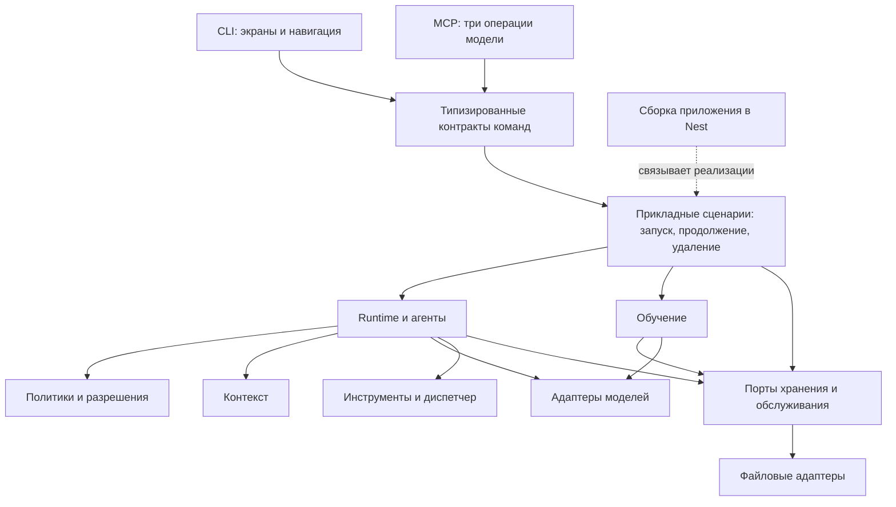

# Развитие архитектуры Harness

Аудит текущих исходников: 12 сентября 2026 года. Это план следующих изменений; перечисленные ниже переносы модулей, индексы и контракты ещё не реализованы. Текущие пользовательские изменения описаны в [плейтесте](playtest.md).

## Основное решение

Сохранить модульный монолит, один npm-проект и одного владельца состояния. Развивать отдельно четыре направления: удобство добавления функций, объём истории, параллельность исполнения и перенос на несколько машин. Эти задачи требуют разных изменений. Рост числа файлов сам по себе не требует микросервисов.

Сильные стороны уже есть: независимый `ModelProvider`, реестр инструментов, разделение CLI и MCP, обязательная проверка прав, журнал перед побочным эффектом, отдельные истории агентов и контроль публикации опыта. Их нужно сохранить при рефакторинге.

## Целевые границы

Доменные модули не импортируют экраны CLI. Хранилище не управляет runtime. Типы инструментов принадлежат инструментам, форматирование текста — интерфейсу. Прикладной сценарий может согласовывать несколько модулей, но не становится универсальным контейнером для всех функций.

| Участок         | Сейчас                                                                  | Следующая граница                                                                                                    |
| --------------- | ----------------------------------------------------------------------- | -------------------------------------------------------------------------------------------------------------------- |
| Сборка          | `interfaces/application.ts`                                             | `application/bootstrap.ts`: Nest, создание и закрытие ресурсов                                                       |
| Полное удаление | `sessions/purge.ts` управляет runtime, learning и очередью              | `application/session-purge.ts`; низкоуровневые операции остаются в `sessions/purge-records.ts` и `learning/purge.ts` |
| API             | `interfaces/routes.ts`, `types.ts`, отдельные Zod-схемы                 | Контракты по функциям: `contracts/runtime.ts`, `learning.ts`, `budget.ts`, `system.ts`                               |
| Хранение        | Runtime зависит от `FileSessionStore`, хотя `SessionStore` уже объявлен | Небольшие используемые порты: чтение задач, журналируемые изменения, артефакты; файловый адаптер реализует их        |
| CLI             | Несколько экранов самостоятельно управляют stdin и raw mode             | Общий жизненный цикл ввода; отдельные данные экрана, renderer и навигация                                            |
| Провайдеры      | Описание разбросано между schema, adapters, catalog и connection        | Статический реестр провайдеров с метаданными настройки и возможностями                                               |

Названия будущих каталогов здесь — проектное предложение. Переносить весь код одним изменением не нужно.

## Приоритеты и проверка результата

### 1. Прикладной слой и контракты API — первый этап

Начать с жизненного цикла приложения и межмодульного удаления. `sessions/purge.ts` сейчас имеет обратную зависимость от runtime и learning. Само наличие такого импорта не доказывает ошибку исполнения, но затрудняет замену хранилища и понимание владельца операции. Координация удаления и восстановления принадлежит прикладному слою; работа с файлами и очистка опыта остаются у владельцев данных.

Затем связать имя команды, параметры и ответ в одном контракте. Сейчас `CliContext.request<T>(method: string)` позволяет вызывающей стороне самостоятельно объявить любой результат. Zod-схема должна быть источником TypeScript-типа; сервер проверяет вход, контрактные тесты — ответ. Обработчики группируются по функции, не по типу транспорта.

Пример желаемого использования: `client.request('runtime.resume', { runId })`. Неверное поле или неизвестное имя метода должны давать ошибку TypeScript без ручного `<StatusView>`. Отдельно нужны версия протокола и стабильные коды ошибок: `RUN_BUSY`, `STALE_PREVIEW`, `OUTCOME_UNKNOWN`, `DATA_REMOVED`. CLI переводит их в понятный следующий шаг, а не распознаёт текст исключения.

**Готовность:** CLI и MCP используют одну схему параметров; модель по-прежнему видит только разрешённые операции; хранилища не импортируют runtime; проверки удаления после сбоя, идемпотентности, разрешений и отмены проходят без изменения поведения.

### 2. Схемы сохранённых данных и миграции — до смены формата

В `sessions/journal.ts` и загрузчиках хранилищ сейчас есть разбор JSON и частичная проверка структуры. Нужны полные схемы записей, отдельная версия хранения и последовательные миграции `vN → vN+1`. Нельзя молча открывать неизвестную версию или принимать повреждённые вложенные поля.

Миграции должны иметь собственный журнал состояния и поддерживать продолжение после сбоя. Перед заменой формата сохраняется пригодный для восстановления источник. Полное удаление — отдельная операция: её намерение записывается до очистки, а временные и резервные копии удаляемого содержимого также учитываются.

**Готовность:** исторические fixtures открываются новой версией; повреждение вложенного поля обнаруживается; неизвестная версия даёт диагностику; прерванная миграция восстанавливается; удалённые данные не возвращаются из старого журнала или снимка.

### 3. Лёгкие сводки и индексы — первый шаг к большой истории

Сейчас `FileSessionStore.list()` сортирует и клонирует полные записи. `system.info` использует такой список и дважды читает полный снимок обучения. `FileSessionStore` также держит в памяти события со снимками состояния. Автообновление нескольких окон усиливает стоимость этих операций.

Сначала добавить компактную сводку задачи: ID, sessionId, заголовок, статус, время, папка, признак скрытия. Счётчики и страницы читаются из неё; большие сообщения и артефакты загружаются при открытии задачи. Индекс обновляет тот же владелец состояния после подтверждённой записи журнала; его можно восстановить, он не заменяет источник истины.

Далее измерить необходимость checkpoints, ленивого чтения журналов и замены полных снимков в каждом событии на изменения состояния. Последний шаг требует миграций и тестов воспроизведения, поэтому не должен маскироваться под ускорение меню.

**Готовность:** воспроизводимый стенд с 1 000 и 10 000 задачами измеряет время старта, RSS, p95 `system.info` и `runtime.history`, размер диска. Запрос сводки не копирует все тексты задач. Численные цели устанавливаются после исходного замера; обещаний производительности без бенчмарка нет.

### 4. Общий жизненный цикл экрана и явная навигация

В `live-select.ts`, `live-confirm.ts`, `text-reader.ts` и `watch.ts` повторяются обработчики клавиш, raw mode, resize и очистка stdin. Ошибки этой границы уже проявлялись в Esc и зависании выхода. Нужна небольшая функция владения терминальным вводом с гарантированным освобождением ресурсов.

Renderer остаётся чистой функцией: снимок данных, размер окна, выбор и прокрутка → кадр. Источник данных отвечает за обновления и прекращение запросов. Навигация возвращает явный результат: назад, выбранное действие, отмена. Состояние списка — поиск, страница, выбранный ID — сохраняется при переходе в задачу и обратно.

Здесь также полезно разделить понятия для пользователя: **задача/переписка**, **этап выполнения** и **агент**. В дальнейшем каталог может группировать этапы по sessionId, а runId останется в технических подробностях. Сейчас полный поиск по этапам сохраняется; смена модели каталога потребует отдельной проверки ссылок и идемпотентности.

**Готовность:** Enter/Esc/Ctrl+C проверяются в настоящем PTY; после ухода нет опроса; выбранный пункт и ввод не теряются; длинные подсказки и подтверждения читаются в 48×24 и 80×24; второй терминал закрывается без остановки чужого сервиса.

### 5. Реестры расширений и общий набор проверок адаптера

Сейчас новый провайдер затрагивает `configuration/schema.ts`, `providers/adapters.ts`, `providers/catalog.ts`, настройки по умолчанию и `guided/connection.ts`. Собрать статическое описание: ID, поддержка streaming и инструментов, каталог моделей, создание адаптера и поля подключения. Особенности протокола остаются в адаптере; UI читает метаданные настройки.

Для инструментов сохранить доверенный реестр и классификацию чтения/записи. `ToolDefinition` стоит перенести из типов провайдера к контрактам инструментов. Произвольная динамическая загрузка кода и отдельная система плагинов пока не нужны.

**Готовность:** учебный провайдер подключается без изменения runtime; учебный инструмент — без изменения executor и policy. Один набор проверяет отмену, обрыв потока, аргументы, usage, stop reason и разрешения. В руководстве разработчика есть конкретный маршрут «добавить провайдера» и «добавить инструмент».

### 6. Воспроизводимая среда разработчика и диагностика поддержки

`npm run check` и матрица GitHub Actions уже существуют. PTY-сценарии пока запускаются отдельными Python-командами, используют `pyte` и импортируют другие сценарии как библиотеку. Следующий шаг — закреплённое тестовое окружение и общие fixtures вместо цепочки импортов.

Нужны понятные команды для полного офлайн-набора и терминального набора. Облачные проверки выполняются отдельно; отсутствие ключа отмечается как пропуск, а не как успешный тест. CI сохраняет отчёт и кадры при ошибке. Установленный пользовательский Codex/OpenCode не должен быть условием офлайн-тестов.

Версия сейчас отдельно указана в CLI, MCP и `system.info`. Сделать единый источник версии приложения, build ID и версии протокола; показывать их в диагностике. Это позволяет отличить старый работающий сервис от только что собранного CLI. Диагностический экспорт по явной команде содержит версии, ОС, проверки и коды ошибок; тексты задач и ключи не включаются по умолчанию.

**Готовность:** чистый checkout проходит документированный путь; все тестовые процессы завершаются; CLI/MCP/service показывают одну сборку; тестовые секреты отсутствуют в диагностике; поддержку можно начать с одного отчёта вместо копирования всего экрана и каталога состояния.

## Порядок небольших изменений

1. Перенести bootstrap и координацию удаления в прикладной слой; поведение сохранить.
2. Ввести контракт и кодированные ошибки для одного законченного сценария: preview → purge → статус. Затем переносить остальные команды по функциям.
3. Объединить владение вводом и результаты навигации экранов, закрепить PTY в локальном QA.
4. Добавить схемы хранения и fixtures миграций, затем компактные индексы и измерения.
5. Объединить метаданные провайдеров при подключении следующего адаптера.
6. Добавить идентичность сборки и диагностический пакет перед распространением приложения.

Каждый шаг имеет самостоятельную проверку и может быть принят отдельно. Не менять одновременно формат хранения, модель навигации и протокол провайдера.

## Когда понадобится несколько процессов или серверов

Пока глобальная очередь защищает порядок локальных чтений и записей, а один процесс владеет журналами. Нельзя просто запустить несколько копий сервиса на общем каталоге. При необходимости нескольких исполнителей сначала нужны: аренда запуска с идентификатором владельца, устойчивый журнал команд, привязка разрешения к исполнителю и конфигурации, восстановление неизвестных исходов и маршрутизация отмены к владельцу процесса.

Для независимых проектов можно рассмотреть очереди по канонической рабочей папке. Это допустимо только после определения области побочного эффекта: произвольная команда или внешний MCP-инструмент может затрагивать несколько проектов, поэтому без такой гарантии общий барьер остаётся.

База данных и отдельное хранилище артефактов потребуются при измеренной нехватке локального хранения, совместной работе или удалённых исполнителях. Порты и миграции готовят такую возможность; немедленное добавление Postgres, брокера, Minio или Kubernetes усложнит нынешний локальный продукт. Количество агентов, параллельные model-запросы и бюджеты остаются явными ограничениями, даже если исполнителей станет больше.

Действующие схемы модулей: [architecture.md](architecture.md). История реализованных улучшений поддержки: [maintainability.md](maintainability.md).
