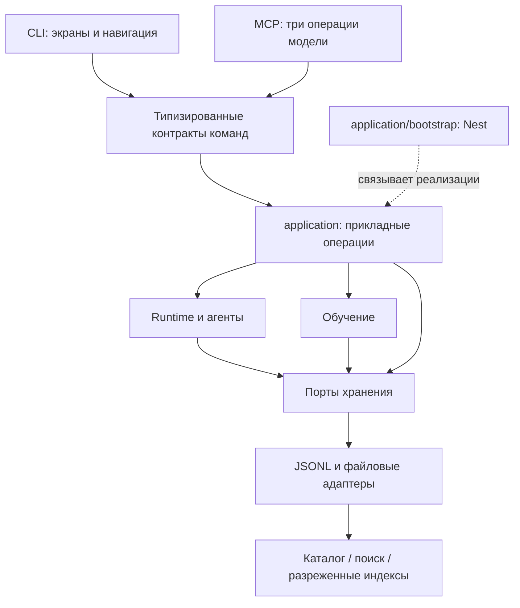

# Развитие архитектуры после 0.3.0

Ветка подготовки `0.3.0` реализует этап «Надёжное локальное ядро». Этот документ разделяет текущие границы и дальнейшие направления. Результаты конкретного выпуска и платформенных проверок следует сверять с [проверкой поставки](release-stability.md); наличие реализации не заменяет прохождение CI.

## Реализованные границы

Harness остаётся модульным монолитом: один npm-проект, локальный сервис и владелец файлового состояния. JSONL сохраняет `schemaVersion: 1`. База данных, удалённые исполнители и новые сценарии автономных проектов в этот этап не входят.

| Область           | Текущее решение                                                                                        | Проверка границы                                                          |
| ----------------- | ------------------------------------------------------------------------------------------------------ | ------------------------------------------------------------------------- |
| Сборка приложения | `application/bootstrap.ts` владеет Nest, runtime, MCP и закрытием ресурсов                             | Старый `interfaces/application.ts` остаётся совместимым экспортом         |
| Команды           | `interfaces/contracts/` связывает имя, аргументы и ответ; `application/commands/` содержит обработчики | Контракты IPC и тесты направлений импортов                                |
| Хранение          | Раздельные порты чтения, записи, артефактов, вывода и обслуживания                                     | Доменные сервисы не импортируют `FileSessionStore`                        |
| Архив             | `SessionArchive`: асинхронное чтение, метаданные, страницы, исторический LRU 64 МиБ                    | Меню не читает журналы; отдельный стенд 1 000 и 10 000 задач              |
| Восстановление    | Проверка вложенных записей, чистый читатель, исправление хвоста только владельцем                      | Повреждение подтверждённой записи оставляет просмотр и диагностику        |
| Удаление          | Координаторы `session-purge.ts` и `data-reset.ts` находятся в `application`                            | Токен предпросмотра, маркер намерения, очистка производных данных и кэшей |
| Диагностика       | Версии приложения, сборки, протокола и хранения; стабильные коды ошибок; `doctor`                      | Старый клиент протокола 1; безопасный экспорт без содержимого задач       |

Подробное описание гарантий и файлов находится в [устройстве реализации](architecture.md). В `test/module-boundaries.test.ts` закреплены направления зависимостей; `test/application-catalog.test.ts` проверяет отсутствие чтения переписки при построении меню и запрет изменений в режиме диагностики.

## Следующий этап: работа с проектом

Следующий крупный шаг имеет смысл начинать с отдельного пользовательского сценария: проект с несколькими связанными задачами, понятным результатом и проверкой завершения. До реализации нужно определить, как задача переходит между состояниями, где человек принимает решение и как отмена проекта влияет на уже выполненные эффекты. Проектная сущность не должна подменять существующие сессию и запуск.

Минимальная независимая часть — представление нескольких задач проекта поверх текущих идентификаторов, без изменения формата истории. Критерий готовности: человек видит цель, активные ветки, результаты и причины ожидания, а после перезапуска получает то же состояние. Автоматическое продолжение после аварии требует отдельного решения; сейчас оно запрещено.

## Развитие интерфейса

CLI сохраняет текущую навигацию и живые экраны. При следующем изменении интерфейса полезно унифицировать владельца клавиатуры и отделить данные экрана от рендера. Основание для рефакторинга — воспроизводимая проблема нескольких владельцев stdin или повторяющиеся сценарии восстановления, а не число файлов.

Новый веб-интерфейс может использовать существующие прикладные команды после отдельного проектирования доступа. Открывать текущий локальный IPC в сеть нельзя считать готовой удалённой архитектурой: нужны аутентификация, полномочия клиента, жизненный цикл подписок и ограничение объёма выдачи. В `0.3.0` веб-интерфейс не реализуется.

## Провайдеры и расширения

Сейчас домен зависит от `ModelProvider`, а особенности облачных моделей находятся в адаптерах. Следующее полезное упрощение — единый статический каталог возможностей провайдера для настройки подключения, списка моделей и диагностики. Делать динамический загрузчик плагинов следует только при появлении самостоятельных сторонних расширений с отдельным жизненным циклом.

Критерий добавления провайдера: полный ответ, структурированные вызовы, обрыв потока, отмена, ограниченный повтор и rate limit проходят один набор контрактных проверок. Произвольный текст не становится исполняемой командой. Провайдер не меняет политики и журналирование побочных эффектов.

## Рост истории и параллельности

До следующей смены хранения нужно сохранять измерения стенда: холодный запуск, RSS, размер состояния, p95 списка и счётчиков. Для прогретого каталога остаётся цель p95 ≤200 мс на Linux CI. Если измерения показывают предел текущего решения, оптимизировать следует конкретную горячую операцию: сортировку метаданных, обновление поисковых данных или чтение страниц. SQLite и новая версия журнала требуют отдельного плана совместимости, резервирования и восстановления миграции.

Общий диспетчер уже отделяет ожидание человека от выполнения инструментов и сохраняет порядок внутри пачки. Расширять параллельные мутации можно только с явной моделью конфликтов ресурсов и тестом восстановления при сбое. Увеличение числа агентов само по себе не обеспечивает полезную параллельность.

## Условия для удалённых исполнителей

Удалённое исполнение оправдано, когда нужна отдельная машина, ОС-изоляция или независимый пул ресурсов. Для него придётся определить устойчивый ID операции, выдачу полномочий, потерю связи после эффекта, отмену дерева процессов и доставку артефактов. Пока этих требований нет, текущий единый владелец состояния проще для эксплуатации и восстановления.

Любая новая абстракция должна появляться на существующей границе ответственности. При приближении файла к 500 строкам сначала проверяются его обязанности; короткие функции и искусственные обёртки не являются самостоятельной целью.
