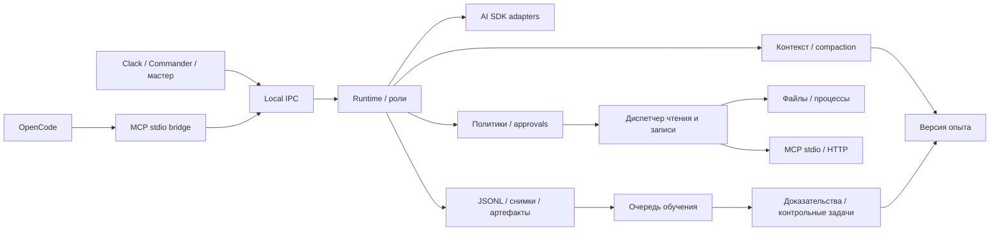

# Устройство реализации

| Модуль          | Основные файлы и границы                                                                                                                                                                                                                                                    |
| --------------- | --------------------------------------------------------------------------------------------------------------------------------------------------------------------------------------------------------------------------------------------------------------------------- |
| `configuration` | `schema.ts` проверяет конфиги, `loader.ts` читает данные; `discovery.ts` ищет проект; `initialize.ts` создаёт конфиги                                                                                                                                                       |
| `policy`        | `service.ts`: пересечение полномочий, приоритет запретов, точная привязка и расходование разрешений                                                                                                                                                                         |
| `context`       | `service.ts`: начало и конец промпта, выбор памяти, лимит опыта, целостные обмены при сжатии                                                                                                                                                                                |
| `providers`     | `types.ts`: независимый `ModelProvider`; `adapters.ts`: библиотеки; `prompt.ts`: отображение сообщений; `sdk-provider.ts`: поток, завершение, тайм-аут, повторы                                                                                                             |
| `runtime`       | `engine.ts`: жизненный цикл; `run-factory.ts`: создание снимка; `agent-loop.ts`: цикл одной роли; `executor.ts`: проверка, разрешения, журнал, исполнение, упаковка результатов                                                                                             |
| `agents`        | `service.ts`: схемы и ограничения; `coordinator.ts`: дочерние задачи, сбор результатов и handoff                                                                                                                                                                            |
| `tools`         | `registry.ts`: `ToolExecutor` и AJV; `scheduler.ts`: общий порядок; `local.ts`: файлы; `process.ts`: окружение и дерево процессов ОС                                                                                                                                        |
| `mcp-client`    | `service.ts`: официальный Client, два транспорта, разрешённые инструменты и доверенная классификация                                                                                                                                                                        |
| `sessions`      | `types.ts`: `SessionStore` и состояние; `store.ts`: журнал и восстановление; `files.ts`: атомарная запись; `journal.ts`: чтение завершённых событий и синхронизированная запись                                                                                             |
| `learning`      | `types.ts`: контракты; `service.ts`: очередь и публикация; `budget.ts`: бюджет; `validation.ts`: доказательства и конфликты; `evaluator.ts`: оценка и продолжение отчёта; `evaluation-checks.ts`: проверки и решение; `store.ts`: журнал и версии                           |
| `interfaces`    | `application.ts`: сборка Nest DI; `ipc.ts`: владелец и сокет; `routes.ts`: локальные команды; `mcp-server.ts`: три публичных инструмента; `cli.ts`: сборка команд; `commands/`: сценарии; `branding.ts`: логотип; `ui.ts`: карточки и наблюдение; `types.ts`: контракты CLI |

Доменные сообщения, результаты модели и инструменты не зависят от SDK. Провайдер передаёт текстовые дельты и опубликованные пояснения через `ModelRequest.onProgress`. Модуль `sessions/output.ts` сохраняет их пачками в отдельный JSONL без копирования состояния запуска на каждый токен. Локальный `runtime.task` выдаёт две курсорные последовательности: события выполнения и поток вывода. `guided/task-feed.ts` объединяет страницы, `task-screen.ts` рисует вкладки через log-update, `screen.ts` управляет сменой страниц. Исполняемые вызовы возвращаются runtime только после проверки полного ответа; частичный текст остаётся предпросмотром. Подписи, зашифрованные блоки и скрытый content Codex в интерфейс не попадают.

Разрешения проверяются перед каждой операцией, включая восстановленные вызовы. Запрос одобрения не расходует тайм-аут исполнения. Ожидающая разрешения запись сохраняет барьер очереди; отмена другого задания снимает его из очереди немедленно. `agents.await` не использует этот барьер.

Состояния запуска: `running`, `awaiting_approval`, `paused`, `completed`, `failed`, `cancelled`. Завершение дочерней ветки возвращает её результат родителю; ошибка ветки отменяет её потомков. Корень формирует итог после сбора дочерних результатов. При неизвестном исходе мутации останавливается дерево задачи. У дочерних агентов отдельные истории, но общие счётчики итераций и handoff.

`HarnessRuntime` последовательно обрабатывает команды создания, продолжения и отмены: запись состояния и регистрация исполнителя завершаются до следующей команды. Это закрывает гонку между двумя окнами CLI, когда отмена могла пропустить ещё не зарегистрированное продолжение. Ожидание остановки модели, инструментов и завершающих обработчиков происходит вне этой очереди; другие задачи и подагенты продолжают работать параллельно. Закрытие runtime сначала дожидается ранее принятых команд запуска. Эти границы проверяют `runtime-cancellation.test.ts` и интеграционный тест `runtime-cancellation-ipc.test.ts` с HTTP 429 и одновременными командами через локальный канал.

`FileSessionStore.recoverInterrupted` вызывается при старте и после остановки исполнителей. Он проверяет сами незавершённые вызовы, включая задачи на паузе и скрытые записи. Запись JSONL определяет подтверждение состояния; `writeSnapshot` обновляет производную JSON-копию после неё. Ошибка этой копии не отменяет зафиксированный результат.

Если исполнитель уже остановился, запись инструмента в состоянии `started` тоже показывается как неизвестный исход: фиксация `unknown` могла не состояться. Человек может проверить её через обычное меню прерванных операций. Подтверждение недоступно до полной остановки исполнителя; при продолжении проверенная мутация не повторяется.

Закрытие локального сервиса прекращает приём RPC и дожидается уже принятых команд перед освобождением `daemon.lock`. Отмена исполнителей начинается до ожидания запросов, чтобы команда ожидания не задерживала их остановку. Повторный `close` ожидает ту же операцию; ошибка одного модуля не пропускает освобождение остальных ресурсов.

Если runtime не смог записать остановку и журнал по-прежнему содержит активное состояние задачи, `FileSessionStore` блокирует новые изменения до перезапуска. `HarnessRuntime.view` дополняет сохранённое состояние диагностикой и `recoveryRequired`; остановленный исполнитель отображается как задача на паузе. Журнал при этом не подменяется. CLI показывает причину, отключает изменение задачи и предлагает перезапуск; `status`, `task`, списки и счётчики используют одно представление. Уже сохранённая пауза допускает ручное восстановление и проверку неизвестных исходов без этого общего ограничения.

`sessions/journal.ts` запоминает длину файла перед дописыванием. При ошибке записи, синхронизации или закрытия он удаляет всю неподтверждённую пачку и синхронизирует откат. Если откат не подтверждён, запись в этот журнал блокируется до перезапуска процесса: прежний кэш нельзя смешивать с неизвестным состоянием файла. Защита общая для задач, обучения и потока вывода. Подтверждение результата инструмента по-прежнему обязательно; отказ его сохранения не разрешает повторить выполненную мутацию.

Откат файлов различает отказ проверки и ошибку после начала изменения. Если путь или содержимое изменились до записи, `FileChanges` возвращает запись из `restoring` в `applied` и фиксирует `file.restore_rejected`. Повтор возможен после нового успешного предпросмотра. Ошибка самой записи или удаления сохраняет неопределённый исход и запрет автоматического повтора.

Подготовленный контекст продолжения связан с ревизией всех этапов беседы, включая скрытые. Перед созданием запуска хранилище в своей очереди повторно проверяет эту ревизию и неизвестные исходы. Если другое окно успело восстановить файл или уточнить результат, запрос отклоняется до вызова модели; повтор с тем же ключом собирает актуальный контекст. Маркер начала отката использует ту же очередь и повторно проверяет активные задачи. Откат старого этапа при продолжении на паузе запрещён, чтобы возобновление не получило устаревшее состояние файлов. Границы проверяет `session-file-races.test.ts`.

Новые ходы получают сведения об откатах из событий всех этапов беседы с датой и исходом на момент события. Уже присутствующие в истории сообщения о проверках повторно не добавляются. Успешный повтор отката снимает прежнюю ручную оценку с текущего состояния изменения; прежняя оценка остаётся в журнале.

`sessions/continuation.ts` объединяет проверку неизвестных исходов, выбор последнего этапа и сбор подтверждённых поправок. Фабрика нового запуска и `resume` используют эти правила совместно. При возобновлении поправки добавляются в сводки незавершённых ролей в одной записи `run.resumed`; незакрытые обмены инструментами сохраняют порядок. Уже добавленная поправка переживает повторную паузу и перезапуск без дублирования. Снимок конфигурации и версия опыта остаются прежними. Совместимость со старыми журналами проверяет `session-resume-recovery.test.ts`.

Последний видимый этап определяется по цепочке `parentRunId`, проходящей и через скрытые записи. Перевод системных часов назад или одинаковые даты не делают предка актуальнее его продолжения. Для старых несвязанных записей сохраняется выбор по дате и идентификатору; циклическая цепочка отклоняется с диагностикой. `session-clock.test.ts` проверяет продолжение после изменения часов и повторной загрузки журналов.

Человек разрешает такой исход через `files.previewResolution` и `files.resolveRestore` в локальном канале. Подтверждение связано с задачей, изменением, путём и текущим состоянием файла. Совпадение с исходной версией даёт `restored`, с записанной — `applied`, частичный или иной результат — `reviewed`. Последний статус разрешает продолжение и удаление беседы, но не автоматическую перезапись файла. Проверка сохраняется в истории и передаётся следующим ходам; эти команды не экспортируются модели.

Горячее чтение авторских конфигов выполняется только при новом запуске. Сервисные настройки, влияющие на уже созданные диспетчеры, MCP-клиенты и очередь обучения, проверяются отдельно: при их изменении новый запуск требует перезапуска сервиса. Исторические снимки не перечитывают внешние файлы и не включают значения ключей из окружения.

Хранилище опыта отделено от конфигурации и исполняемого кода. Генератор получает задачу и доказательства одной роли; проверочные ожидания остаются внутри evaluator. Синхронизированный JSONL-журнал и атомарный снимок содержат очередь, доказательства, кандидатов, результаты каждого сравнения, версии и активный указатель. Повторная обработка исходного запуска не дублирует задание. Откат переключает активный указатель; содержимое старой версии остаётся доступно запускам, которые её уже зафиксировали.

Контрольные инструменты возвращают только заданные тестовые значения. Политика проверяется и на них. В этой реализации доверенные проверки декларативны: подстроки ответа и ожидаемые структурированные вызовы с аргументами. Полезность урока за пределами контрольного набора не доказана; для своей предметной области нужен собственный достаточно разнообразный набор.

Команда `runtime.delete` доступна локальному CLI и не экспортируется в MCP. Она ставит `deletedAt` только остановленному запуску. Обычная история исключает такие задачи, а поиск ключей повторного запроса и чтение доказательств сохраняют доступ к ним.

Общая очистка проходит через `application/data-reset.ts`: предпросмотр фиксирует выбранный состав (`tasks`, `learning`, `all`), а подтверждение сверяет его перед захватом файлов. Общий диспетчер и блокировки обслуживания исключают одновременный запуск задач и обучения. `data-reset-records.ts` хранит намерение очистки для восстановления после сбоя; старые ключи запросов остаются защищёнными от повторного исполнения. При очистке знаний идентификаторы прежних запусков исключаются из автоматического повторного обучения. Настройки, подключения, файлы проектов и числовой учёт расхода не входят в область очистки.

`runtime/usage.ts` сохраняет оценочный расход до запроса и сообщённые провайдером токены после ответа. Токеновых квот нет: прежние поля лимитов читаются только для совместимости со снимками. `learning/budget.ts` ведёт отдельный учёт обучения и соблюдает ручную паузу и приоритет пользовательских задач. Смена старых значений квоты не мешает возобновлению; проверка совместимости MCP, параллелизма и состояния обучения остаётся.

`runtime/iterations.ts` хранит предел новых задач в `iteration-settings.json`, с резервным значением `limits.turns` из конфигурации. В запуске `iterationLimit` и `iterationStart` отделяют размер текущей порции от общего `turns`. Проверка внутри сериализованного изменения состояния общая для всех агентов; достижение предела приостанавливает дерево. Причина остановки сохраняется до отмены дочерних запросов, чтобы гонка с abort не превратила паузу в ошибку. Явное возобновление открывает следующую порцию после проверки неизвестных эффектов и совместимости сервиса. Изменение предела не меняет исходный снимок конфигурации или разрешения.

`diagnostics/` отвечает за опциональный технический JSONL-лог: закрытый набор полей, последовательную запись, ротацию и сохранённый переключатель. `observe-command.ts` оборачивает локальную диспетчеризацию, не получая тела RPC. Ошибки журнала показываются в его настройках и не меняют результат задачи. Лог отделён от обязательного журнала сессии: отключение диагностики не отключает восстановление состояния.

Удаление записи и потеря связи различаются через `shared/resource-errors.ts`. IPC передаёт только известный код и вид ресурса. Просмотр удалённой задачи или урока очищает старое содержимое; временный разрыв соединения сохраняет экран и продолжает переподключение. Оба пути проверяются отдельно, включая удаление из другого окна.

Формат файлов локальный и рассчитан на один сервис. Нет удалённого публичного HTTP API управления, ОС-изоляции, базы данных, отдельного брокера, распределённой блокировки и обновления весов модели: эти функции не входят в согласованный вариант.

Переносимость ОС сосредоточена в `interfaces/local-channel.ts`, `tools/process.ts` и синхронизации файлов. CLI-сценарии настройки и диагностики не требуют активного runtime. Состояние канала не попадает в конфигурацию модели.
